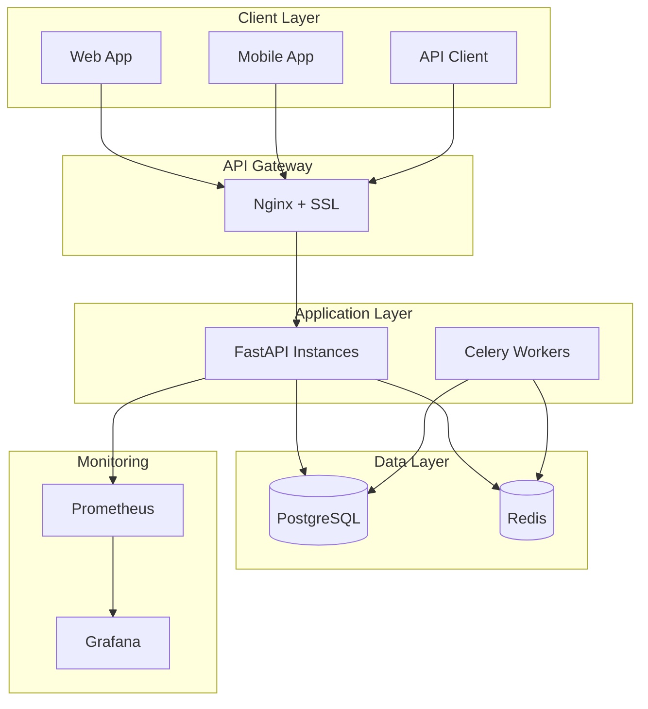

# 🏥 Healthcare Scheduling API

A production-grade FastAPI application for healthcare appointment scheduling with HIPAA compliance, role-based access control, and comprehensive monitoring.

## ✨ Key Features

- 🔐 **HIPAA Compliant** - Healthcare data protection and audit logging
- 👥 **Role-Based Access** - Admin, Doctor, and Patient roles with fine-grained permissions
- 📅 **Smart Scheduling** - Conflict detection, recurring appointments, and waitlist management
- 🔔 **Multi-Channel Notifications** - Email, SMS, push, and in-app notifications
- 📊 **Real-Time Monitoring** - Prometheus metrics, Grafana dashboards, and health checks
- 🚀 **Production Ready** - Auto-scaling, load balancing, and disaster recovery
- 🔒 **Enterprise Security** - Encryption, audit trails, and compliance features

## 🛠️ Tech Stack

| Component | Technology | Purpose |
|-----------|------------|---------|
| **Backend** | FastAPI + Python 3.11 | REST API server |
| **Database** | PostgreSQL 16 + SQLAlchemy 2.x | Primary data storage |
| **Cache** | Redis 7 | Caching and sessions |
| **Background** | Celery | Asynchronous task processing |
| **Auth** | JWT + OAuth2 | Authentication and authorization |
| **Monitoring** | Prometheus + Grafana | Metrics and dashboards |
| **Logging** | ELK Stack | Log aggregation and analysis |
| **Container** | Docker + Docker Compose | Application containerization |
| **CI/CD** | GitHub Actions | Continuous integration/deployment |

## 🚀 Quick Start

### **Docker (Recommended)**
```bash
# Clone and setup
git clone https://github.com/your-org/healthcare-scheduling-api.git
cd healthcare-scheduling-api
cp .env.example .env

# Start all services
docker compose up -d && make upgrade && make seed
```

**API**: `http://localhost:8000` | **Docs**: `http://localhost:8000/docs`

### **Local Development**
```bash
# Setup
python -m venv venv && source venv/bin/activate
pip install -r requirements.txt
cp .env.example .env

# Database
alembic upgrade head
python -m app.scripts.seed

# Start services
make run          # API server
make worker       # Background worker (separate terminal)
```

## 📚 API Documentation

### **Core Endpoints**

| Method | Endpoint | Description | Auth Required |
|--------|----------|-------------|---------------|
| `GET` | `/health` | Health check | No |
| `POST` | `/api/v1/auth/token` | Get access token | No |
| `GET` | `/api/v1/users/me` | Current user info | Yes |
| `GET` | `/api/v1/appointments` | List appointments | Yes |
| `POST` | `/api/v1/appointments` | Book appointment | Yes |
| `GET` | `/api/v1/availability` | Doctor availability | Yes |

### **Authentication**
```bash
# Get token
curl -X POST "http://localhost:8000/api/v1/auth/token" \
  -H "Content-Type: application/x-www-form-urlencoded" \
  -d "username=admin@example.com&password=admin123"

# Use token
curl -H "Authorization: Bearer <token>" \
  "http://localhost:8000/api/v1/users/me"
```

### **Book Appointment**
```bash
curl -X POST "http://localhost:8000/api/v1/appointments" \
  -H "Authorization: Bearer <token>" \
  -H "Content-Type: application/json" \
  -d '{
    "doctor_id": "doctor-uuid",
    "start_time": "2024-01-20T10:00:00Z",
    "reason": "Regular checkup"
  }'
```

## 🏗️ Architecture

### **System Overview**


### **Architecture Documentation**
- **[System Architecture](./architecture/system-architecture.md)** - Complete system design
- **[Database Schema](./architecture/database-schema.md)** - Database design and relationships
- **[API Architecture](./architecture/api-architecture.md)** - API design and endpoints
- **[Deployment Architecture](./architecture/deployment-architecture.md)** - Infrastructure and deployment

## 🔧 Development

### **Available Commands**
```bash
# Development
make run              # Start API server
make worker           # Start Celery worker
make test             # Run tests
make lint             # Lint code
make fmt              # Format code

# Database
make migrate          # Create migration
make upgrade          # Apply migrations
make seed             # Seed data

# Docker
make docker-up        # Start containers
make docker-down      # Stop containers
make docker-logs      # View logs

# Production
make prod-up          # Start production stack
make prod-health      # Check health
make backup           # Create backup
```

### **Testing**
```bash
# Run all tests
make test

# Run specific test categories
make test-unit        # Unit tests
make test-integration # Integration tests
make test-e2e         # End-to-end tests

# Coverage report
make test-coverage
```

## 🚀 Production Deployment

### **Docker Compose**
```bash
# Production deployment
make prod-up

# Check status
make prod-status
make prod-health
```

### **Kubernetes**
```bash
# Deploy to Kubernetes
kubectl apply -f k8s/

# Check deployment
kubectl get pods -n healthcare-api
```

### **Automated Deployment**
```bash
# Run deployment script
sudo ./scripts/deploy.sh
```

## 📊 Monitoring

### **Health Checks**
- **Basic**: `GET /health`
- **Detailed**: `GET /api/v1/health/detailed`
- **Readiness**: `GET /api/v1/health/readiness`
- **Liveness**: `GET /api/v1/health/liveness`

### **Metrics & Dashboards**
- **Prometheus**: `http://localhost:9090`
- **Grafana**: `http://localhost:3000`
- **API Metrics**: `GET /metrics`

### **Logging**
- **Application Logs**: Structured JSON logging
- **Access Logs**: Nginx access logs
- **Audit Logs**: Security and compliance logs

## 🔒 Security

### **Authentication & Authorization**
- JWT tokens with refresh mechanism
- OAuth2 password flow
- Role-based access control (RBAC)
- Fine-grained permissions

### **Data Protection**
- AES-256 encryption at rest
- TLS 1.3 for data in transit
- HIPAA compliance features
- Comprehensive audit logging

### **Network Security**
- WAF protection
- Rate limiting
- CORS configuration
- Security headers

## 📚 Documentation

- **[API Documentation](./README.md#api-documentation)** - Complete API reference
- **[Production Deployment](./PRODUCTION_DEPLOYMENT.md)** - Production setup guide
- **[HIPAA Compliance](./HIPAA_COMPLIANCE.md)** - Security and compliance
- **[Architecture](./architecture/)** - System architecture documentation

## 🤝 Contributing

1. Fork the repository
2. Create a feature branch
3. Make your changes
4. Add tests
5. Submit a pull request

## 📄 License

This project is licensed under the MIT License - see the [LICENSE](LICENSE) file for details.

## 📞 Support

- **Documentation**: Check the docs directory
- **Issues**: Create a GitHub issue
- **Discussions**: Use GitHub discussions
- **Security**: Report security issues privately

---

**Status**: Production Ready ✅