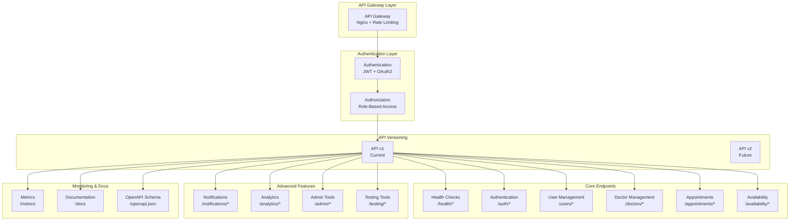
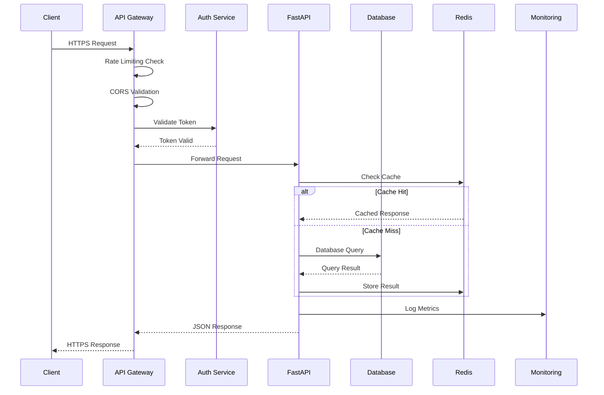
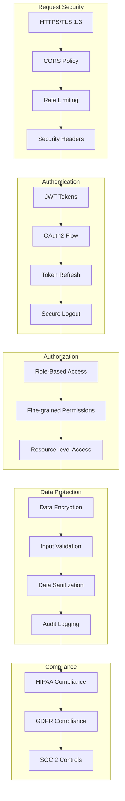
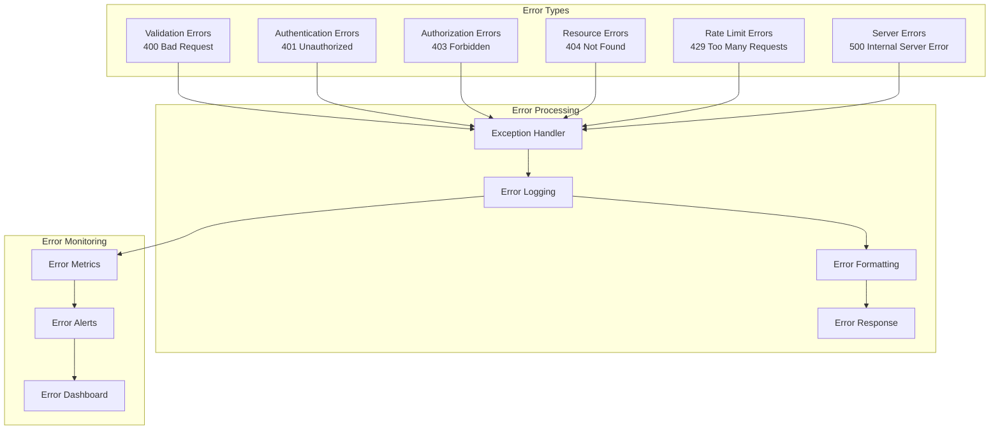
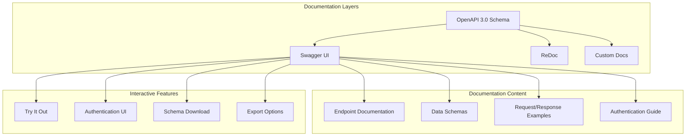
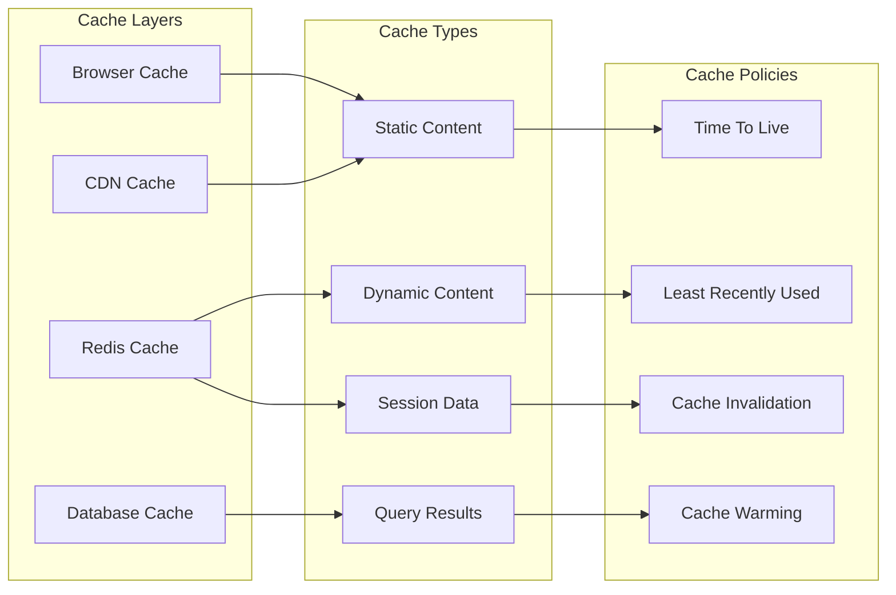
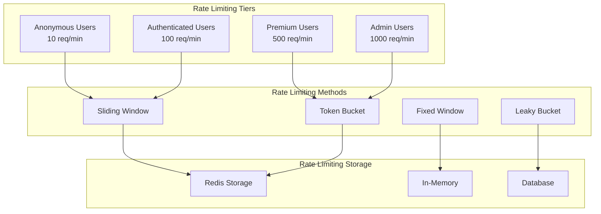
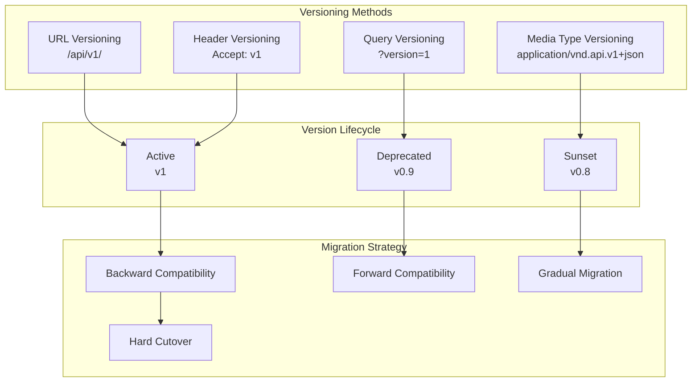
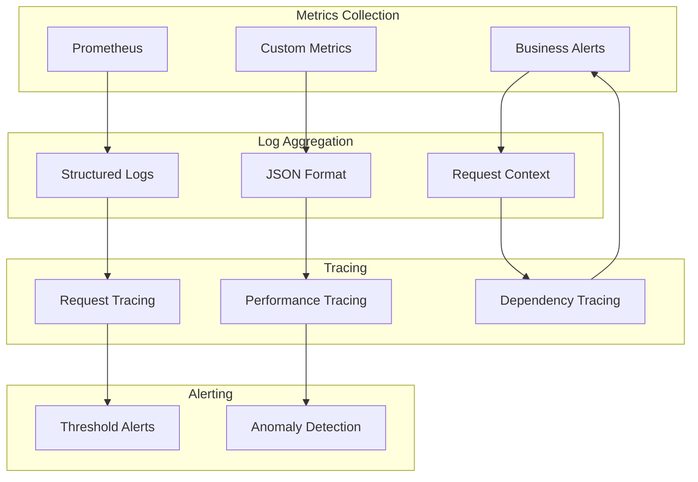
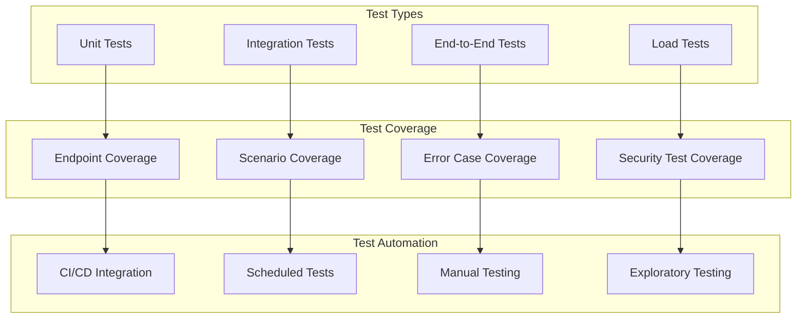

# 🔌 Healthcare Scheduling API - API Architecture

## Overview

The API follows RESTful principles with comprehensive security, monitoring, and documentation features.

## API Endpoint Structure



## API Endpoint Map

### **Core Endpoints**

```mermaid
graph LR
    subgraph "Health & Status"
        H1[GET /health]
        H2[GET /health/detailed]
        H3[GET /health/readiness]
        H4[GET /health/liveness]
        H5[GET /health/metrics]
    end
    
    subgraph "Authentication"
        A1[POST /auth/signup]
        A2[POST /auth/token]
        A3[POST /auth/refresh]
        A4[POST /auth/logout]
    end
    
    subgraph "User Management"
        U1[GET /users/me]
        U2[GET /users/{user_id}]
        U3[POST /users]
        U4[PATCH /users/{user_id}]
        U5[DELETE /users/{user_id}]
    end
    
    subgraph "Doctor Management"
        D1[GET /doctors]
        D2[GET /doctors/{doctor_id}]
        D3[POST /doctors]
        D4[PATCH /doctors/{doctor_id}]
        D5[DELETE /doctors/{doctor_id}]
    end
    
    subgraph "Appointments"
        AP1[GET /appointments]
        AP2[GET /appointments/{appointment_id}]
        AP3[POST /appointments]
        AP4[PATCH /appointments/{appointment_id}]
        AP5[POST /appointments/{appointment_id}/cancel]
    end
    
    subgraph "Availability"
        AV1[GET /availability]
        AV2[GET /availability/{availability_id}]
        AV3[POST /availability]
        AV4[PATCH /availability/{availability_id}]
        AV5[DELETE /availability/{availability_id}]
    end
```

## Request/Response Flow



## Security Architecture



## Error Handling Architecture



## API Documentation Structure



## Performance Optimization

### **Caching Strategy**



### **Rate Limiting Strategy**



## API Versioning Strategy



## Monitoring & Observability



## API Testing Strategy


