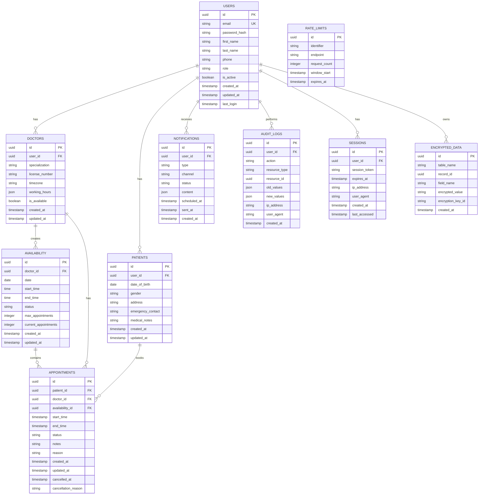

# 🗄️ Healthcare Scheduling API - Database Schema

## Overview

The database schema is designed for a healthcare scheduling system with HIPAA compliance, supporting users, appointments, availability, and audit trails.

## Entity Relationship Diagram



## Table Descriptions

### **Core Tables**

#### **USERS**
Primary user table storing authentication and basic profile information.

| Column | Type | Description |
|--------|------|-------------|
| `id` | UUID | Primary key |
| `email` | VARCHAR(255) | Unique email address |
| `password_hash` | VARCHAR(255) | Bcrypt hashed password |
| `first_name` | VARCHAR(100) | User's first name |
| `last_name` | VARCHAR(100) | User's last name |
| `phone` | VARCHAR(20) | Phone number |
| `role` | ENUM | User role (admin, doctor, patient) |
| `is_active` | BOOLEAN | Account status |
| `created_at` | TIMESTAMP | Account creation time |
| `updated_at` | TIMESTAMP | Update timestamp |
| `last_login` | TIMESTAMP | Last login time |

#### **DOCTORS**
Extended profile for healthcare providers.

| Column | Type | Description |
|--------|------|-------------|
| `id` | UUID | Primary key |
| `user_id` | UUID | Foreign key to USERS |
| `specialization` | VARCHAR(100) | Medical specialization |
| `license_number` | VARCHAR(50) | Medical license number |
| `timezone` | VARCHAR(50) | Doctor's timezone |
| `working_hours` | JSON | Weekly schedule |
| `is_available` | BOOLEAN | Current availability status |

#### **PATIENTS**
Extended profile for patients.

| Column | Type | Description |
|--------|------|-------------|
| `id` | UUID | Primary key |
| `user_id` | UUID | Foreign key to USERS |
| `date_of_birth` | DATE | Patient's birth date |
| `gender` | VARCHAR(10) | Patient's gender |
| `address` | TEXT | Patient's address |
| `emergency_contact` | VARCHAR(100) | Emergency contact info |
| `medical_notes` | TEXT | Medical history notes |

#### **AVAILABILITY**
Doctor availability slots.

| Column | Type | Description |
|--------|------|-------------|
| `id` | UUID | Primary key |
| `doctor_id` | UUID | Foreign key to DOCTORS |
| `date` | DATE | Availability date |
| `start_time` | TIME | Slot start time |
| `end_time` | TIME | Slot end time |
| `status` | ENUM | Available, booked, cancelled |
| `max_appointments` | INTEGER | Maximum appointments per slot |
| `current_appointments` | INTEGER | Current appointment count |

#### **APPOINTMENTS**
Scheduled appointments.

| Column | Type | Description |
|--------|------|-------------|
| `id` | UUID | Primary key |
| `patient_id` | UUID | Foreign key to PATIENTS |
| `doctor_id` | UUID | Foreign key to DOCTORS |
| `availability_id` | UUID | Foreign key to AVAILABILITY |
| `start_time` | TIMESTAMP | Appointment start time |
| `end_time` | TIMESTAMP | Appointment end time |
| `status` | ENUM | Scheduled, completed, cancelled, no-show |
| `notes` | TEXT | Appointment notes |
| `reason` | TEXT | Appointment reason |
| `cancelled_at` | TIMESTAMP | Cancellation time |
| `cancellation_reason` | TEXT | Reason for cancellation |

### **Supporting Tables**

#### **NOTIFICATIONS**
Notification queue and history.

| Column | Type | Description |
|--------|------|-------------|
| `id` | UUID | Primary key |
| `user_id` | UUID | Foreign key to USERS |
| `type` | ENUM | Email, SMS, push, in-app |
| `channel` | VARCHAR(50) | Notification channel |
| `status` | ENUM | Pending, sent, failed |
| `content` | JSON | Notification content |
| `scheduled_at` | TIMESTAMP | Scheduled send time |
| `sent_at` | TIMESTAMP | Actual send time |

#### **AUDIT_LOGS**
Comprehensive audit trail for HIPAA compliance.

| Column | Type | Description |
|--------|------|-------------|
| `id` | UUID | Primary key |
| `user_id` | UUID | Foreign key to USERS |
| `action` | VARCHAR(50) | Action performed |
| `resource_type` | VARCHAR(50) | Type of resource affected |
| `resource_id` | UUID | ID of affected resource |
| `old_values` | JSON | Previous values |
| `new_values` | JSON | New values |
| `ip_address` | INET | User's IP address |
| `user_agent` | TEXT | User's browser/client |

#### **ENCRYPTED_DATA**
Stores encrypted PHI data.

| Column | Type | Description |
|--------|------|-------------|
| `id` | UUID | Primary key |
| `table_name` | VARCHAR(50) | Source table name |
| `record_id` | UUID | Source record ID |
| `field_name` | VARCHAR(50) | Encrypted field name |
| `encrypted_value` | TEXT | AES-256 encrypted value |
| `encryption_key_id` | VARCHAR(50) | Key identifier |

## Indexes

### **Performance Indexes**

```sql
-- User lookups
CREATE INDEX idx_users_email ON users(email);
CREATE INDEX idx_users_role ON users(role);
CREATE INDEX idx_users_active ON users(is_active);

-- Doctor availability
CREATE INDEX idx_availability_doctor_date ON availability(doctor_id, date);
CREATE INDEX idx_availability_status ON availability(status);
CREATE INDEX idx_availability_date_range ON availability(date, start_time, end_time);

-- Appointments
CREATE INDEX idx_appointments_patient ON appointments(patient_id);
CREATE INDEX idx_appointments_doctor ON appointments(doctor_id);
CREATE INDEX idx_appointments_start_time ON appointments(start_time);
CREATE INDEX idx_appointments_status ON appointments(status);
CREATE INDEX idx_appointments_doctor_date ON appointments(doctor_id, start_time);

-- Audit logs
CREATE INDEX idx_audit_user ON audit_logs(user_id);
CREATE INDEX idx_audit_action ON audit_logs(action);
CREATE INDEX idx_audit_created_at ON audit_logs(created_at);
CREATE INDEX idx_audit_resource ON audit_logs(resource_type, resource_id);

-- Notifications
CREATE INDEX idx_notifications_user ON notifications(user_id);
CREATE INDEX idx_notifications_status ON notifications(status);
CREATE INDEX idx_notifications_scheduled ON notifications(scheduled_at);

-- Sessions
CREATE INDEX idx_sessions_user ON sessions(user_id);
CREATE INDEX idx_sessions_token ON sessions(session_token);
CREATE INDEX idx_sessions_expires ON sessions(expires_at);
```

### **Composite Indexes**

```sql
-- Appointment queries
CREATE INDEX idx_appointments_doctor_status_time ON appointments(doctor_id, status, start_time);
CREATE INDEX idx_appointments_patient_status_time ON appointments(patient_id, status, start_time);

-- Availability queries
CREATE INDEX idx_availability_doctor_status_date ON availability(doctor_id, status, date);

-- Audit queries
CREATE INDEX idx_audit_user_action_time ON audit_logs(user_id, action, created_at);
```

## Constraints

### **Check Constraints**

```sql
-- Time validation
ALTER TABLE availability ADD CONSTRAINT chk_availability_time 
    CHECK (end_time > start_time);

-- Appointment time validation
ALTER TABLE appointments ADD CONSTRAINT chk_appointment_time 
    CHECK (end_time > start_time);

-- Email validation
ALTER TABLE users ADD CONSTRAINT chk_email_format 
    CHECK (email ~* '^[A-Za-z0-9._%+-]+@[A-Za-z0-9.-]+\.[A-Za-z]{2,}$');

-- Phone validation
ALTER TABLE users ADD CONSTRAINT chk_phone_format 
    CHECK (phone ~* '^\+?[1-9]\d{1,14}$');

-- Role validation
ALTER TABLE users ADD CONSTRAINT chk_role 
    CHECK (role IN ('admin', 'doctor', 'patient'));

-- Status validation
ALTER TABLE appointments ADD CONSTRAINT chk_appointment_status 
    CHECK (status IN ('scheduled', 'completed', 'cancelled', 'no-show'));

ALTER TABLE availability ADD CONSTRAINT chk_availability_status 
    CHECK (status IN ('available', 'booked', 'cancelled'));
```

### **Foreign Key Constraints**

```sql
-- Doctor relationships
ALTER TABLE doctors ADD CONSTRAINT fk_doctors_user 
    FOREIGN KEY (user_id) REFERENCES users(id) ON DELETE CASCADE;

-- Patient relationships
ALTER TABLE patients ADD CONSTRAINT fk_patients_user 
    FOREIGN KEY (user_id) REFERENCES users(id) ON DELETE CASCADE;

-- Availability relationships
ALTER TABLE availability ADD CONSTRAINT fk_availability_doctor 
    FOREIGN KEY (doctor_id) REFERENCES doctors(id) ON DELETE CASCADE;

-- Appointment relationships
ALTER TABLE appointments ADD CONSTRAINT fk_appointments_patient 
    FOREIGN KEY (patient_id) REFERENCES patients(id) ON DELETE CASCADE;

ALTER TABLE appointments ADD CONSTRAINT fk_appointments_doctor 
    FOREIGN KEY (doctor_id) REFERENCES doctors(id) ON DELETE CASCADE;

ALTER TABLE appointments ADD CONSTRAINT fk_appointments_availability 
    FOREIGN KEY (availability_id) REFERENCES availability(id) ON DELETE CASCADE;

-- Notification relationships
ALTER TABLE notifications ADD CONSTRAINT fk_notifications_user 
    FOREIGN KEY (user_id) REFERENCES users(id) ON DELETE CASCADE;

-- Audit relationships
ALTER TABLE audit_logs ADD CONSTRAINT fk_audit_user 
    FOREIGN KEY (user_id) REFERENCES users(id) ON DELETE SET NULL;

-- Session relationships
ALTER TABLE sessions ADD CONSTRAINT fk_sessions_user 
    FOREIGN KEY (user_id) REFERENCES users(id) ON DELETE CASCADE;
```

## Data Partitioning

### **Time-based Partitioning**

```sql
-- Partition appointments by month
CREATE TABLE appointments_2024_01 PARTITION OF appointments
    FOR VALUES FROM ('2024-01-01') TO ('2024-02-01');

CREATE TABLE appointments_2024_02 PARTITION OF appointments
    FOR VALUES FROM ('2024-02-01') TO ('2024-03-01');

-- Partition audit logs by month
CREATE TABLE audit_logs_2024_01 PARTITION OF audit_logs
    FOR VALUES FROM ('2024-01-01') TO ('2024-02-01');
```

## Backup Strategy

### **Full Backup**
- Daily full database backup
- Compressed and encrypted
- Stored in S3 with 30-day retention

### **Incremental Backup**
- Hourly incremental backups
- WAL (Write-Ahead Log) archiving
- Point-in-time recovery capability

### **Data Retention**
- **Active Data**: 7 years (HIPAA requirement)
- **Audit Logs**: 7 years
- **Backup Data**: 30 days
- **Archived Data**: Indefinite (encrypted)

## Security Considerations

### **Data Encryption**
- **At Rest**: AES-256 encryption for sensitive fields
- **In Transit**: TLS 1.3 for all connections
- **Key Management**: AWS KMS or similar

### **Access Control**
- **Row-Level Security**: User-based data access
- **Column-Level Security**: Sensitive field protection
- **Audit Logging**: All data access logged

### **Compliance**
- **HIPAA**: Healthcare data protection
- **SOC 2**: Security controls
- **GDPR**: Data privacy rights
