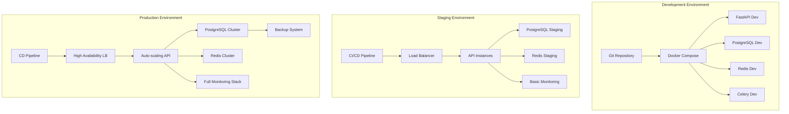
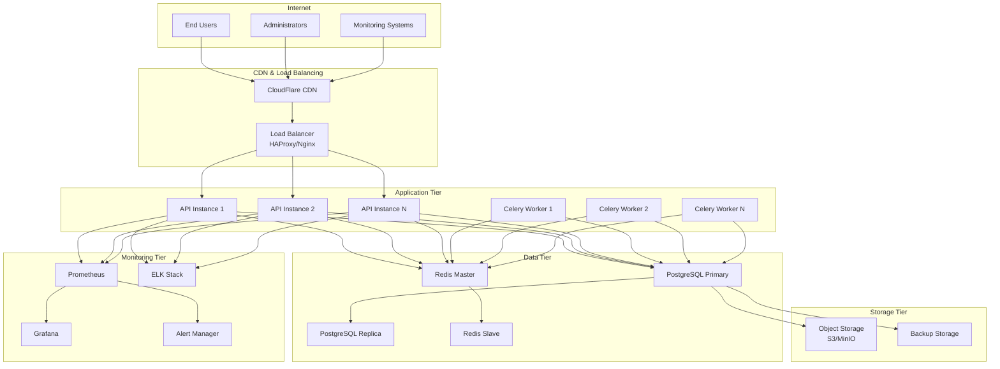
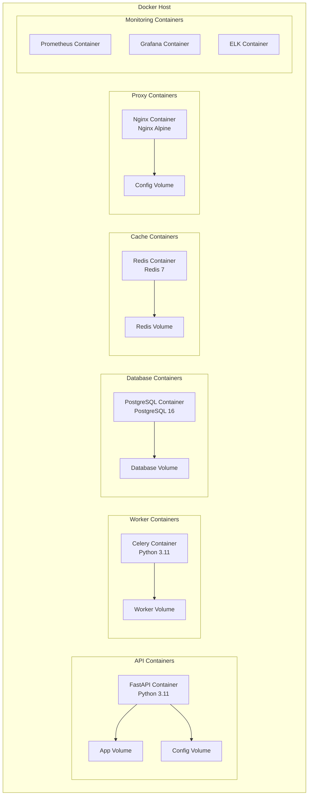
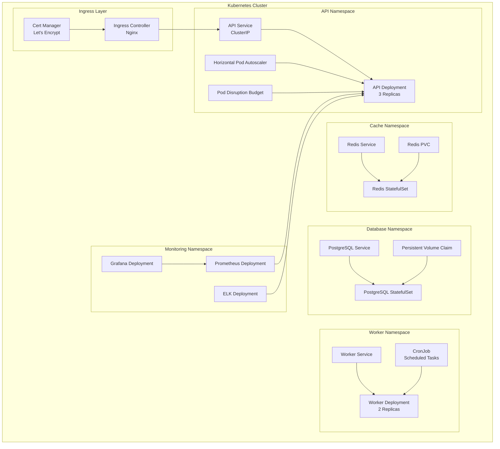
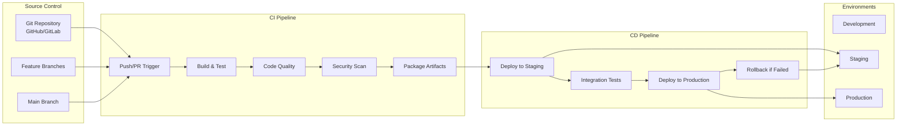
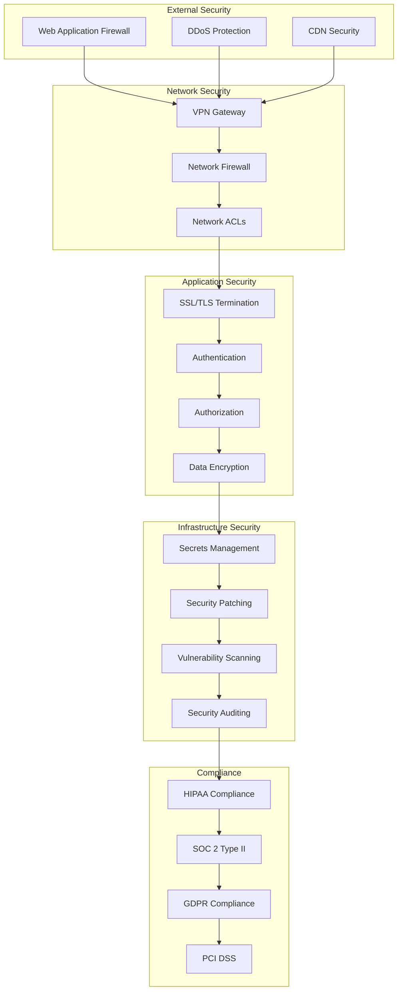
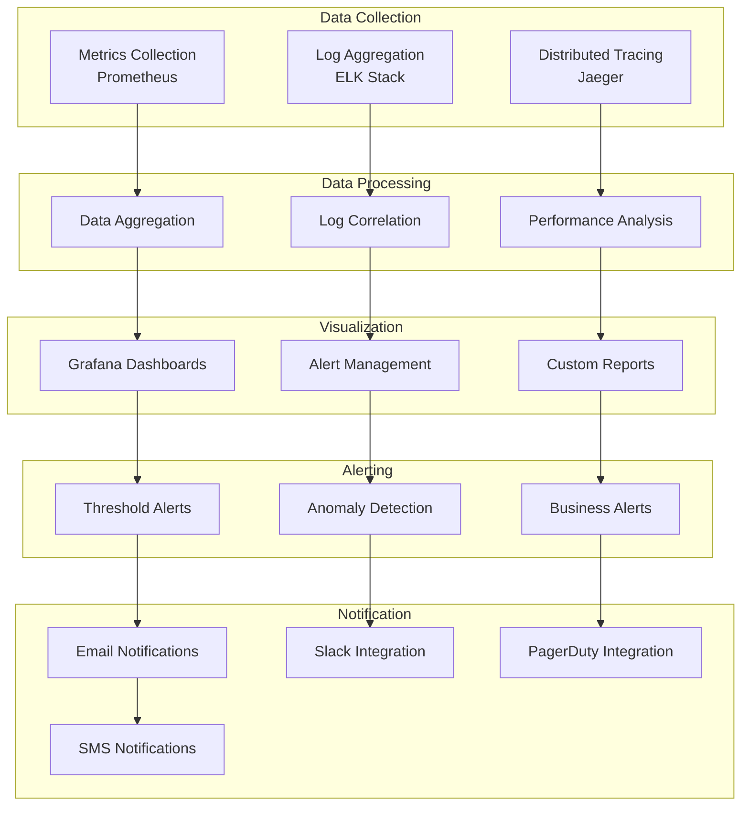
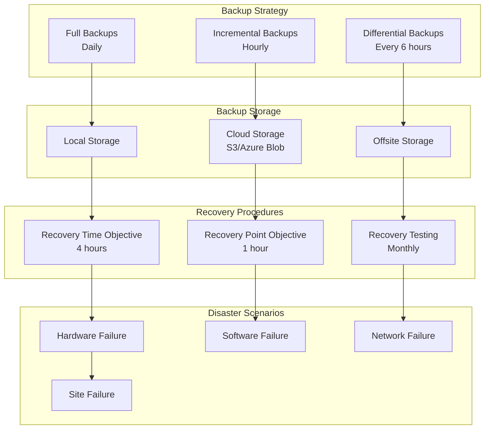
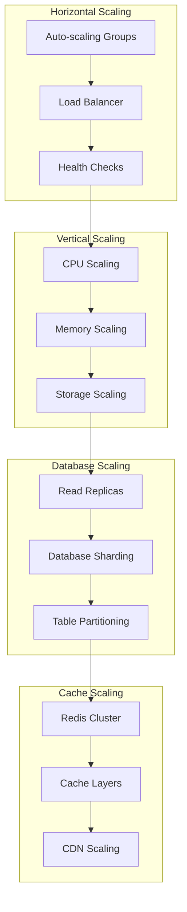
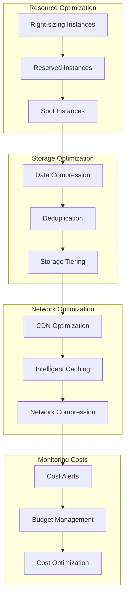

# 🚀 Healthcare Scheduling API - Deployment Architecture

## Overview

Multi-environment deployment strategy supporting development, staging, and production with comprehensive monitoring and security.

## Environment Architecture

## Production Infrastructure

## Container Architecture

## Kubernetes Architecture

## CI/CD Pipeline

## Security Architecture

## Monitoring & Observability

## Backup & Disaster Recovery

## Scaling Strategy

## Cost Optimization

