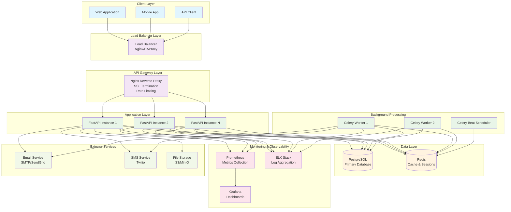
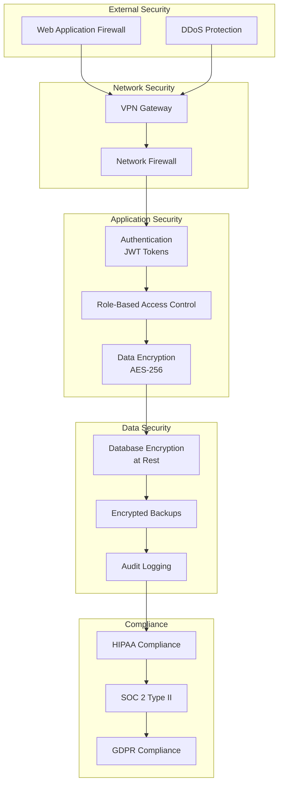
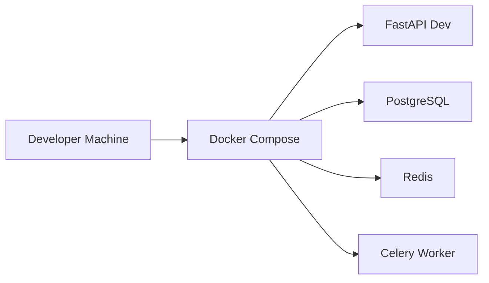
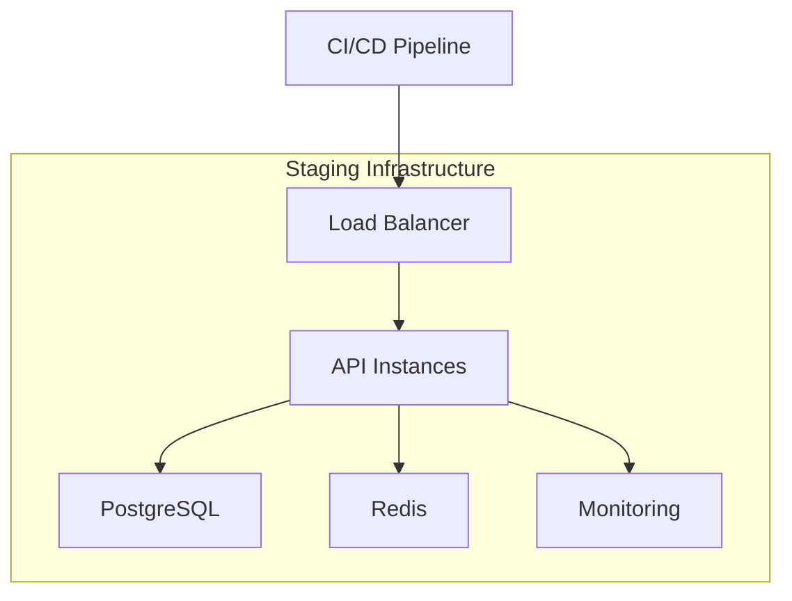
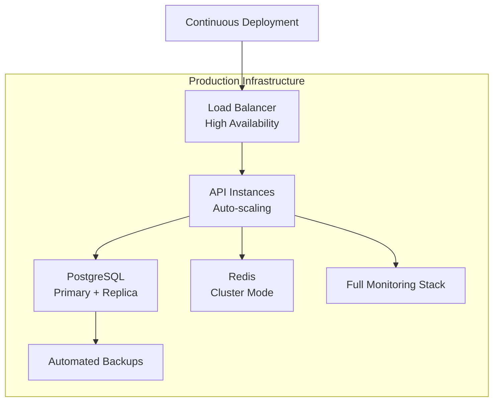
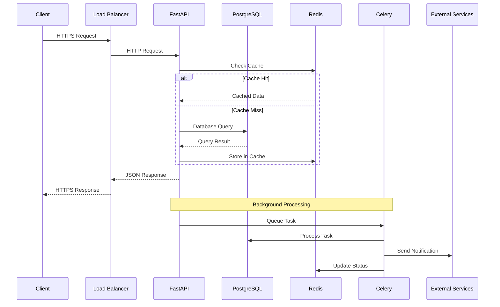
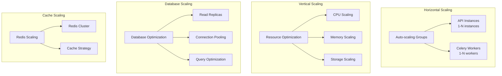

# 🏗️ Healthcare Scheduling API - System Architecture

## Overview

The Healthcare Scheduling API is built with a microservices architecture designed for high availability, scalability, and HIPAA compliance.

## High-Level Architecture

## Component Details

### **Client Layer**
- **Web Application**: React/Vue.js frontend
- **Mobile App**: iOS/Android applications
- **API Client**: Third-party integrations

### **Load Balancer Layer**
- **Load Balancer**: Distributes traffic across API instances
- **Health Checks**: Monitors backend service health
- **SSL Termination**: Handles HTTPS encryption

### **API Gateway Layer**
- **Nginx Reverse Proxy**: Request routing and load balancing
- **Rate Limiting**: Prevents API abuse
- **Security Headers**: HIPAA compliance headers
- **CORS Management**: Cross-origin request handling

### **Application Layer**
- **FastAPI Instances**: Multiple API server instances
- **Celery Workers**: Background task processing
- **Celery Beat**: Scheduled task management
- **Auto-scaling**: Dynamic instance scaling based on load

### **Data Layer**
- **PostgreSQL**: Primary relational database
- **Redis**: Caching and session storage
- **Connection Pooling**: Optimized database connections
- **Backup Strategy**: Automated backups with point-in-time recovery

### **Monitoring & Observability**
- **Prometheus**: Metrics collection and alerting
- **Grafana**: Visualization and dashboards
- **ELK Stack**: Log aggregation and analysis
- **Health Checks**: Comprehensive system monitoring

### **External Services**
- **Email Service**: Appointment reminders and notifications
- **SMS Service**: Text message notifications
- **File Storage**: Document and image storage

## Security Architecture

## Deployment Architecture

### **Development Environment**

### **Staging Environment**

### **Production Environment**

## Data Flow Architecture

## Scalability Architecture

## Technology Stack

| Layer | Technology | Purpose |
|-------|------------|---------|
| **Frontend** | React/Vue.js | User interface |
| **API Gateway** | Nginx | Load balancing, SSL termination |
| **Backend** | FastAPI (Python 3.11) | REST API server |
| **Database** | PostgreSQL 16 | Primary data storage |
| **Cache** | Redis 7 | Caching and sessions |
| **Background** | Celery | Asynchronous task processing |
| **Monitoring** | Prometheus + Grafana | Metrics and dashboards |
| **Logging** | ELK Stack | Log aggregation |
| **Container** | Docker | Application containerization |
| **Orchestration** | Docker Compose/K8s | Container orchestration |
| **CI/CD** | GitHub Actions | Continuous integration/deployment |
